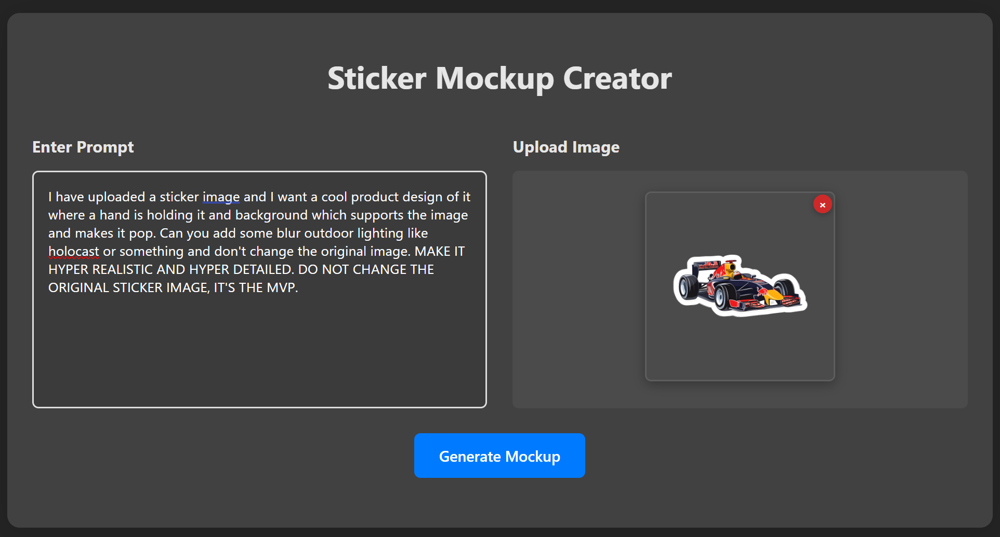
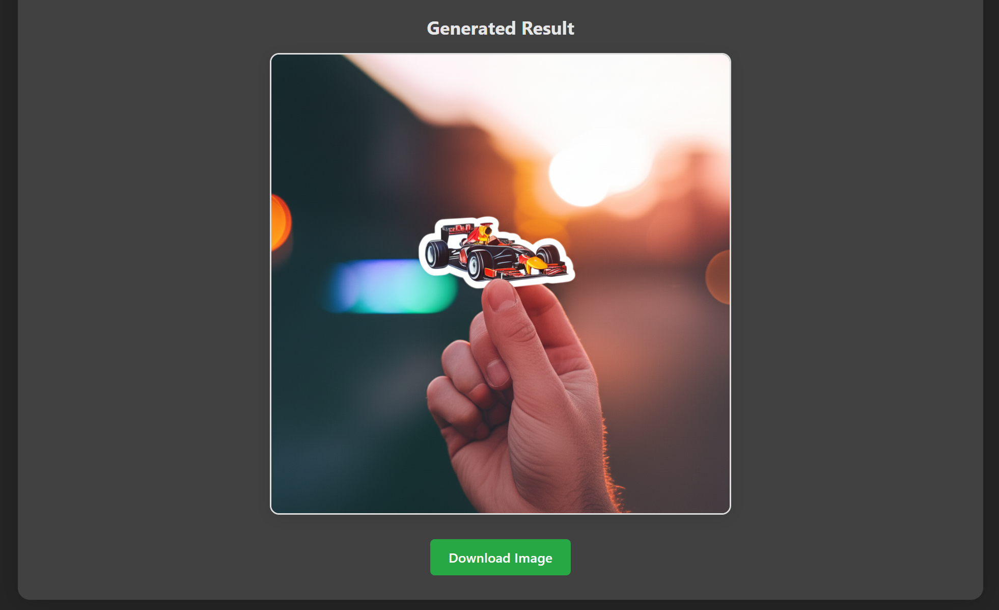

# Sticker Mockup Creator

A simple web app to generate hyper-realistic product mockups from your sticker designs using Google Gemini's image generation API.

## Features

- Upload a sticker image and preview it instantly
- Enter a custom prompt to describe your desired product mockup
- Generate a hyper-realistic, detailed product image using Gemini
- Download the generated image

## Demo




## Getting Started

### Prerequisites
- Node.js

### Setup
1. **Clone the repository:**
   ```bash
   git clone https://github.com/224Abhay/AI-Sticker-Mockup-Creator.git
   cd sticker-mockup-creator
   ```
2. **Install dependencies:**
   ```bash
   npm install
   ```
3. **Configure your Gemini API key:**
   - Create a .env file in the root of your project (next to package.json) and add your API key
   ```
   VITE_GEMINI_API_KEY=your_actual_api_key_here
   ```
      - Like given in the example above

4. **Start the development server:**
   ```bash
   npm run dev
   ```
   The app will be available at [http://localhost:2314](http://localhost:2314).

## Usage
1. Enter a prompt describing your desired product mockup.
2. Upload a sticker image (JPG, PNG, etc.).
3. Click **Generate** to create a hyper-realistic product image.
4. Download the generated image if you like the result.

## Deployment
You can deploy this app to any static hosting service (Vercel, Netlify, GitHub Pages, etc.) after running:
```bash
npm run build
```
The production-ready files will be in the `dist/` folder.

## License

This project is licensed under the MIT License. See [LICENSE](LICENSE) for details.
