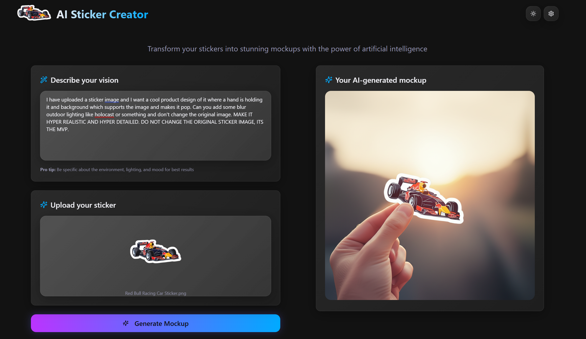

# AI Sticker Mockup Creator

Transform your stickers into stunning mockups with the power of Google's Gemini AI. This web application allows you to upload stickers and generate realistic mockups by describing your vision using natural language.


### Live Demo

Experience the AI Sticker Mockup Creator in action:

**[Click here to visit the site](https://224abhay.github.io/ai-sticker-mockup-creator/)**

### Example



The live demo is hosted on GitHub Pages and includes all the features mentioned above. You can upload your stickers and generate mockups directly in your browser!

## Features

- **AI-Powered Mockup Generation**: Uses Google's Gemini 2.0 Flash Preview for high-quality image generation
- **Intuitive Interface**: Clean, modern UI with dark/light theme support
- **Secure API Management**: Secure storage and management of your Gemini API key
- **Real-time Generation**: Watch your mockups come to life with real-time progress indicators
- **Responsive Design**: Works seamlessly on desktop, tablet, and mobile devices
- **Download Support**: Download your generated mockups in high quality
- **Regeneration**: Generate multiple variations of your mockups with a single click

## Prerequisites

Before you begin, ensure you have:

- Node.js 18+ installed
- A Google Gemini API key from [Google AI Studio](https://makersuite.google.com/app/apikey)
- Git installed

## Quick Start

### 1. Clone the Repository

```bash
git clone https://github.com/224Abhay/ai-sticker-mockup-creator.git
cd ai-sticker-mockup-creator
```

### 2. Install Dependencies

```bash
npm install
```

### 3. Start Development Server

```bash
npm run dev
```

Open [http://localhost:2314](http://localhost:2314) to view it in the browser.

### 4. Configure API Key

1. Click the settings button (gear icon) in the top-right corner
2. Enter your Gemini API key
3. Click "Save changes"

## How to Use

### Step 1: Upload Your Sticker
- Click the upload area in the "Upload your sticker" section
- Select a PNG, JPG, or JPEG file
- Your sticker will be previewed

### Step 2: Describe Your Vision
- In the "Describe your vision" section, write a detailed prompt
- Be specific about the environment, lighting, and mood
- Example: "A cute sticker on a laptop in a cozy coffee shop with warm lighting"

### Step 3: Generate Mockup
- Click the "Generate Mockup" button
- Wait for the AI to process your request
- Your mockup will appear in the result section

### Step 4: Download or Regenerate
- Hover over the generated image to see action buttons
- Click "Download" to save the mockup
- Click "Regenerate" to create a new variation

## 🔧 Configuration

### API Key Setup

1. Visit [Google AI Studio](https://makersuite.google.com/app/apikey)
2. Create a new API key
3. Copy the key and paste it in the settings dialog
4. The key is securely stored in your browser's localStorage

## Build for Production

```bash
npm run build
```

The build files will be created in the `dist` directory.

## License

This project is licensed under the MIT License - see the [LICENSE](LICENSE) file for details.

